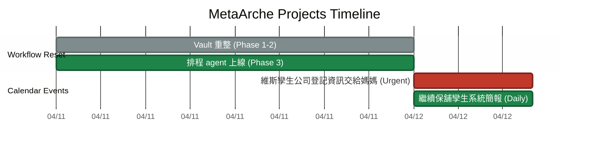

# 📊 Projects Dashboard

> 這份檔案是所有進行中專案的總覽 + 甘特圖。
> 資料主要由排程 agent 從 Google Calendar 同步,使用者也可以手動編輯。
> 甘特圖用 Obsidian 原生 Mermaid `gantt`,不需要任何 plugin。

## 🎯 當前專案 (Active Projects)

| 專案 | 狀態 | 起始 | 預計結束 | 備註 |
|---|---|---|---|---|
| Workflow 重整 | #doing | 2026-04-11 | 2026-04-11 | vault 最小化 + 排程 agent |

## 📅 甘特圖 (Gantt)

> 下方 mermaid block 是 agent 會自動維護的區塊。使用者手動改也可以,agent 會以 `%% AUTO-SYNC %%` 註解為界,只動自動區。

## 📥 來自 Google Calendar 的事件 (Auto-synced)

> 這個區塊由 agent 每日晨間更新。格式是方便人讀的清單。

**最後同步:** 2026-04-12 08:11 Asia/Taipei (vault-morning-sync)

### 📅 今日 (2026-04-12 週日)

- 09:00–17:00 **維斯孿生公司登記資訊交給媽媽** (Urgent Tasks) — 時間窗口寬鬆,今天內完成即可
- 14:00–22:00 **繼續保舖孿生系統簡報** (Daily Tasks) — 下午到晚間的深度工作時段

### 📆 本週剩餘

- 今日即為本週最後一天,本週已無其他事件
- 下週 (2026-04-13 ~ 2026-04-19) 目前所有 7 個行事曆皆無事件

### 👥 共享行事曆提醒

- Francis (本人): 無行程
- Sylvie: 無行程

## 🧭 使用說明

- **新增里程碑:** 直接編輯上面的 mermaid block 的「手動區」,用 Obsidian 預覽模式就能看到 gantt 渲染
- **狀態標記:** `done` = 完成, `active` = 進行中, `crit` = 關鍵路徑, (空) = 尚未開始
- **不要動 AUTO-SYNC 區塊**:那是 agent 的地盤,手動改會被下次同步覆蓋

## 🔗 相關

- [[Workflow]] — 整體工作流說明
- [[Claude Memory]] — 使用者偏好與行事曆對應表

---

*初始化於 2026-04-11*
