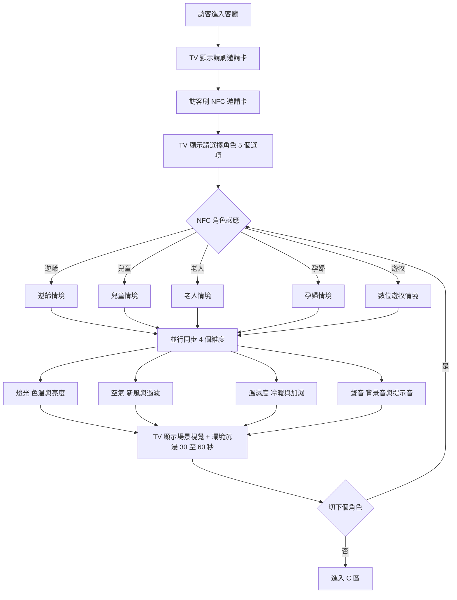
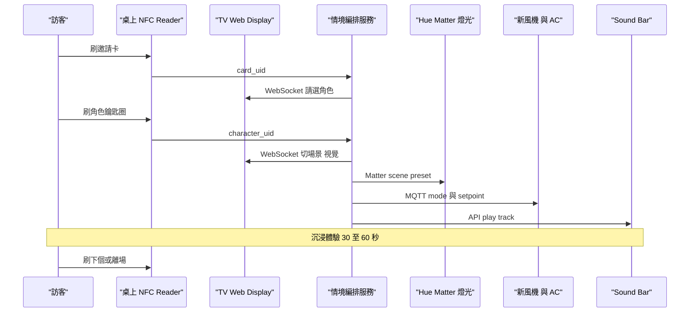
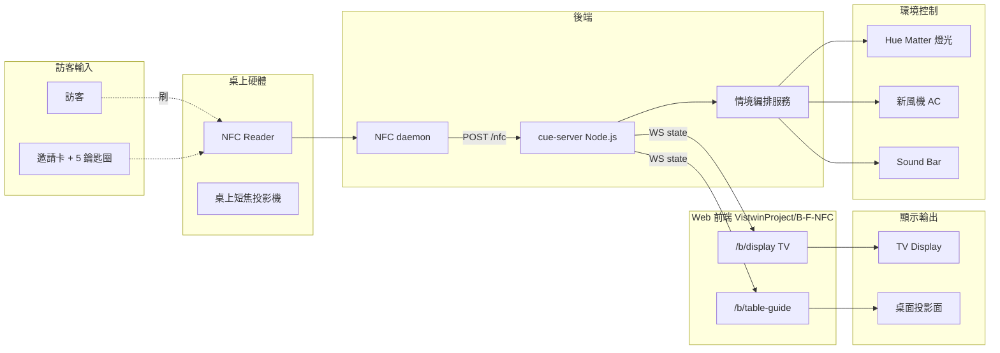

# 感應光寓 · 客廳

## 區域定位

樣品屋客廳。訪客在桌上刷邀請卡 → 從 5 個情境角色中挑一個 → 整個客廳的**光 / 空氣 / 溫濕度 / 聲音**四維度同步切換成為對應的「智慧居家狀態」。把 OTA120「全健築」的核心承諾從數字面板昇華成**全身體感**:選孕婦 → 室內就變成孕婦需要的環境;選兒童 → 整個房間調成兒童需要的條件。

**架構**:**TV(主顯示)** 跑 Web,顯示提示 / 角色選擇 / 場景視覺。**桌上投影 + NFC reader** — 桌上短焦投影只跑「NFC 放置提示 UI」(指引訪客把卡 / 鑰匙圈放哪),NFC reader 嵌桌做實際感應觸發。**環境設備**(燈 / 空氣 / 聲)同步切換。沒有 iPad。

## 頁面流程



## 系統互動



## 元件清單

| Component | 角色 | 既有 repo / 設備 | 新做 / 改造 |
|---|---|---|---|
| TV Display | 主顯示 — 提示 + 角色選擇 UI + 場景視覺,**Web kiosk** | 大尺寸 TV + browser kiosk | **改造**(web kiosk 模式 + 場勘 TV 尺寸) |
| 桌上投影 | 輔助 — 投影「NFC 放置提示」UI,指引卡 / 鑰匙圈位置(Web) | 短焦投影機(吊頂或桌邊) | **採購** + **改造**(web) |
| 桌上 NFC Reader | 純觸發硬體 — 感應邀請卡 + 5 個角色鑰匙圈 | USB ACR122U / RPi PN532,嵌桌 | **採購 + 整合** |
| Web Apps(TV + 桌上) | 跑在 TV kiosk 與桌上投影上的訪客互動 UI | [`VistwinProject/B-F-NFC`](https://github.com/VistwinProject/B-F-NFC)(Vite + React 18 + framer-motion 11) | **改造** — 加情境模式 + WS 接收 |
| 情境編排服務 | 5 個情境的 light/air/temp/sound 同步指令,接 NFC 輸入 | — | **新做** — Node.js(同 `B-F-NFC` repo 的 `bridge/`) |
| Hue / Matter | 燈光控制 | Philips Hue Bridge | 既有架構 |
| AC + 新風機 | 空氣 / 溫度 | 寶舖既有 + MQTT 控制器 | 寶舖提供 |
| Sound Bar | 背景音 / 聲學情境 | 待選(Sonos / Bose Smart Soundbar) | **採購** |
| 邀請卡 + 5 NFC 鑰匙圈 | 訪客 token | NTAG215 + 物理外觀 | **採購 + 客製** |

## Web 架構

**2 個 web 前端(TV 主 + 桌上輔助)+ 共用 cue-server**。桌上 NFC reader 是硬體,不是 web。

技術架構圖:



```
/b/display     (TV,Web kiosk 主顯示)
├── /idle              待機畫面(歡迎訊息 / 環境氛圍動畫)
├── /prompt/card       請刷邀請卡
├── /prompt/character  請選角色 5 個選項
├── /scene/逆齡        逆齡情境視覺 + 環境啟動中
├── /scene/兒童
├── /scene/老人
├── /scene/孕婦
├── /scene/遊牧
└── /loop              情境體驗中(輕量動畫 + 倒數)

/b/table-guide (桌上投影,輔助提示 UI)
├── /idle              桌面氛圍動畫
├── /place/card        把邀請卡放這(animated NFC 圖示在感應點上方)
├── /place/character   把角色鑰匙圈放這
└── /confirmed         感應成功提示(2-3 秒 fadeout)
```

- **repo**:[`VistwinProject/B-F-NFC`](https://github.com/VistwinProject/B-F-NFC)(B 兩 web + F 三 web 都同 monorepo,以 route 分頁)
- **build target**:Vite + React 18 + framer-motion 11
- **state 同步**:WebSocket → cue-server,TV `/b/display` 跟桌上 `/b/table-guide` 同步狀態(TV 提示「請刷卡」時桌上同步亮起 `/place/card`)
- **桌上 NFC**:本機 daemon 讀 reader,POST `/nfc` 給 cue-server,觸發後 cue-server 廣播給兩個 web 前端
- **cue-server**:共用後端,規格定義在 [[F-AI大腦控制塔#cue-server-共用後端]];B 區關注的 API:
  - `POST /nfc` 接 card_uid 與 character_uid
  - `WS /ws/state` 廣播當前 role 給 TV display
  - `POST /override` 展務員手動切(走另一台筆電,不在訪客視野)

## 未決點

- [ ] **TV 尺寸與擺位**:客廳場景 TV 多大、掛牆 / 桌上 / 立架,影響 web kiosk 排版
- [ ] **桌上短焦投影機選型**:距離 / 流明 / 投影面尺寸(只投 NFC 提示 UI,亮度需求比 A 區低很多)
- [ ] **桌上投影 + NFC reader 對位**:UI 上的「放這」圖示要精準對應感應點實體位置
- [ ] **NFC reader 嵌桌方式**:嵌底(透投影面)/ 桌面感應點 / 桌邊感應槽
- [ ] iOS 系統的 NFC 限制不影響(我們不用 iPad,reader 走 USB → 本機 daemon)
- [ ] 情境編排服務跟 `B-F-NFC` 同 repo 還是另開
- [ ] 5 個情境的 setpoint 是否走寶舖 APP 既有控制管道,還是我們直接打設備
- [ ] 多訪客同時刷不同角色 → 後到的覆蓋還是排隊
- [ ] 情境切換的 fade 時間(瞬間切 vs 5 秒漸變)
- [ ] 鑰匙圈丟失補發 / 防偷
- [ ] OTA120 文件提到的 5 個 persona 跟簡報 v6 對應(逆齡 / 兒童 / 老人 / 孕婦 / 數位遊牧)— 鑰匙圈視覺要對應這 5 個

## Related

- 上游:[[A-數據之門]]
- 下游:[[C-睡眠劇場]]
- 同期:[[D-居家風險劇場]]
- 同棧(NFC + 桌上投影 共用):[[F-AI大腦控制塔]] — B 用 TV 主顯示 + 桌上 NFC 投影提示,F 用桌上 NFC 互動投影(物件詳情)+ 牆面投影 + iPad;NFC reader 與桌上短焦投影機同款可共用
- 上層:[[01 專案/寶鋪 showcase/README|寶舖 showcase MOC]]
- 規格:[[01 專案/寶鋪 showcase/deliverables/OTA120_v6_draft|OTA120 v6 草稿]]
