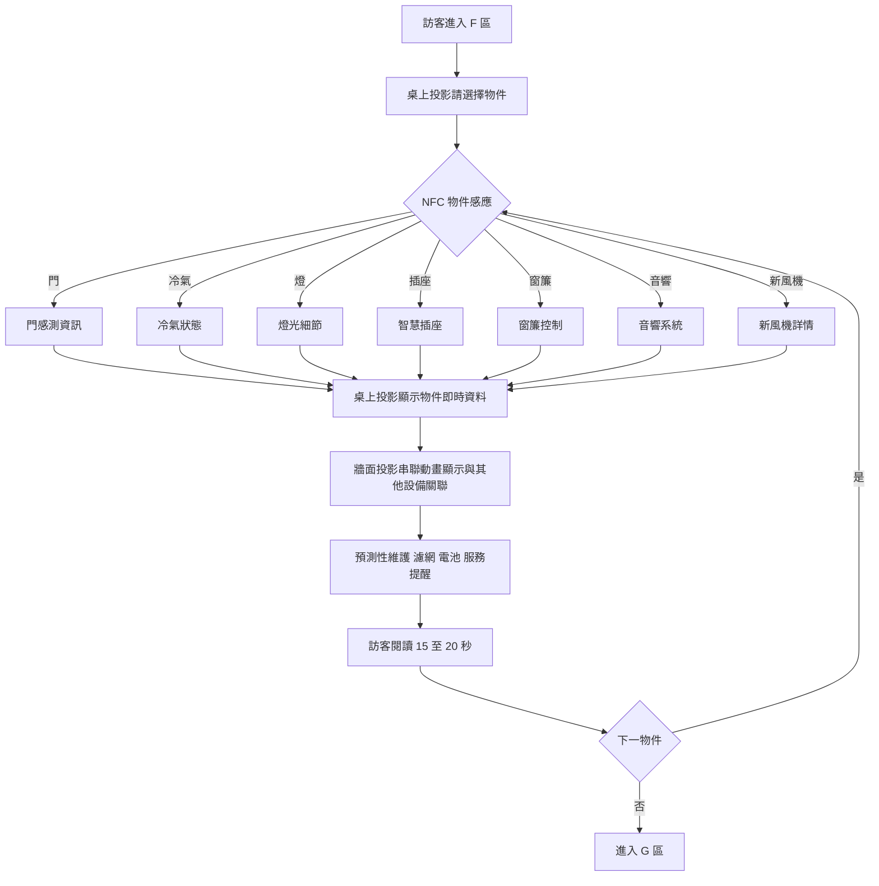
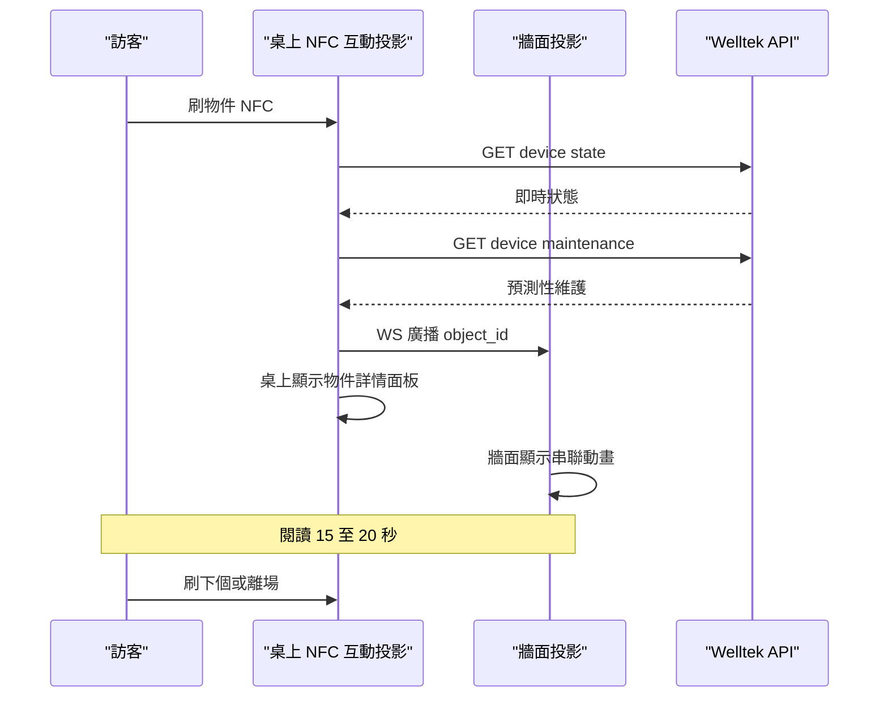
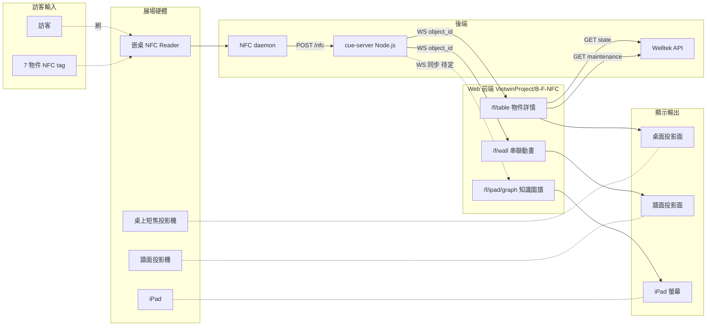

# AI 大腦控制塔 · 後台暗場 F 區

## 區域定位

策展後台第二站(E 區建築中控台之後)。訪客在控制檯**桌上 NFC 互動投影**刷代表家電的實體物件(門、冷氣、燈、插座、窗簾、音響、新風機),**桌上投影**顯示該物件即時狀態 + 預測性維護,**牆面投影**同步串聯動畫(設備間關聯)。重點傳達「AI 大腦」不是抽象概念,而是**真的在後台主動管理家中設備、提前預警**。

**3 個展示 surface**:桌上 **NFC 互動投影**(短焦投影 + 嵌桌 NFC reader + Web)+ 牆面投影(串聯動畫,Web)+ **iPad**(Web 跑 AI 知識圖譜)。

> iPad 跑同 `B-F-NFC` repo 內的 `/f/ipad/graph` route,內容**只有 AI 知識圖譜**。是否跟桌上刷物件 WS 同步(刷物件 → 知識圖譜高亮對應節點)待定。

## 頁面流程



## 系統互動



## 元件清單

| Component | 角色 | 既有 repo / 設備 | 新做 / 改造 |
|---|---|---|---|
| 桌上 NFC 互動投影 | 訪客 surface — 刷物件 + 投影顯示物件即時資料 + 預測性維護 | [`VistwinProject/B-F-NFC`](https://github.com/VistwinProject/B-F-NFC)+ 短焦投影機 + 嵌桌 NFC reader | **採購**(投影機 + reader)+ **改造**(web) |
| 牆面投影 | 串聯動畫(設備間關聯) | 短焦投影 + Web canvas / framer-motion 動畫 | **採購**(投影機)+ **改造**(動畫) |
| 7 個物件 NFC tag | 門/冷氣/燈/插座/窗簾/音響/新風機 token | NTAG215 + 物件外觀(mock-up) | **新做** — 物件外觀設計 + NFC 配對 |
| Welltek API | 設備狀態 + 維護資料 | 寶舖 / Welltek 既有 | 寶舖提供,需確認 API spec |
| 預測性維護資料源 | 濾網週期 / 電池電量 / 服務提醒 | 簡報明列新風機週期;其他待補 | **資料模型新做** — 7 個物件各定義維護欄位 |
| iPad | 第 3 個展示 surface — **Web 跑 AI 知識圖譜**(僅此功能) | iPad + Safari/Chrome kiosk,跑 [`VistwinProject/B-F-NFC`](https://github.com/VistwinProject/B-F-NFC) 的 `/f/ipad/graph` | **改造**(web)— 加知識圖譜 module |

## Web 架構

**3 個 web 前端(桌上 + 牆面 + iPad)+ 共用 cue-server**

技術架構圖:



```
/f/table  (桌上 NFC 互動投影,投影顯示物件詳情面板)
├── /idle                 待機 + 請刷物件
├── /object/door
├── /object/ac
├── /object/light
├── /object/plug
├── /object/curtain
├── /object/sound
├── /object/fan
├── /object/:id/maintenance   預測性維護 overlay
└── /transition           物件切換動畫

/f/wall   (牆面投影,串聯動畫)
├── /idle                 7 物件網絡 overview
├── /active/:id           高亮當前物件 + 關聯設備
└── /relation/:id         串聯動畫(門→冷氣→新風機 連鎖)

/f/ipad   (iPad — Web 跑 AI 知識圖譜,僅此功能)
├── /graph                 7 物件 + 設備關聯知識圖譜全景
├── /graph/:node           節點詳情(該物件的關聯設備、依賴鏈、AI 推理路徑)
└── /graph/path/:from/:to  兩節點間連鎖關係動畫
```

- **repo**:[`VistwinProject/B-F-NFC`](https://github.com/VistwinProject/B-F-NFC)(與 B 區共用同 repo,monorepo 內以 route 分頁)
- **build target**:Vite + React 18 + framer-motion 11
- **state 同步**:WS 廣播當前 object_id,/f/table 跳 panel、/f/wall 同步高亮;/f/ipad 是否同步(訪客刷物件 → 知識圖譜高亮對應節點)待定

## cue-server(共用後端)

B、F 兩區共用同一台 Node.js cue-server(整個展也可選擇延用,跨 7 區):

```
POST /nfc           {reader_id, uid, kind: "card"|"character"|"object"}
                    入口統一,後端根據 reader_id 路由給對應區的 handler
WS   /ws/state      廣播 { zone, scene/object, timestamp }
GET  /scenes        列出 B 區 5 角色情境定義
GET  /objects       列出 F 區 7 物件 + Welltek 對應
POST /override      {zone, payload} 展務員手動覆寫(走另一台筆電)
```

- **部署選項**:(a) 一台 cue-server 管全展(路由清楚、單點故障)(b) B/F 各一台(隔離但部署複雜)— 待拍
- **NFC 接入**:USB ACR122U 或 RPi PN532 走 serial → 本機 daemon → POST /nfc
- **WS 客戶端**:每個前端頁開啟時 subscribe 自己 zone,收到 state 即更新 route

## 未決點

- [ ] **iPad 知識圖譜規格**:
  - 圖譜範圍 — 只 F 區 7 物件 / 加進 B 區 5 角色 / 全展 ontology
  - 訪客可互動(拖、縮、點)還是純展示自動播
  - 跟桌上 NFC 是否 WS 同步(刷物件 → 知識圖譜高亮對應節點)
  - 操作方式 — 訪客手持 / 桌邊固定立架 / 展務員講解
- [ ] **桌上短焦投影機選型**:距離 / 流明 / 投影面尺寸
- [ ] **NFC reader 嵌桌方式**:嵌底 / 透投影面 / 桌邊感應
- [ ] **桌上 + 牆面對齊**:訪客視角是否同時看到桌上面板 + 牆面動畫,還是視線需切換
- [ ] Welltek API spec 寶舖能不能提供(簡報 p.38 6 個物件都標「需寶鋪提供」)
- [ ] 預測性維護資料是 mock 還是真實 — 展期短可以 mock,長期則接寶舖系統
- [ ] 物件 mock-up 由策展公司做還是我們做(影響交付週期)
- [ ] 多人同時刷不同物件 → 排隊 / 分螢幕 / 拒絕
- [ ] NFC tag 物件外形要不要做成跟實品按比例的縮小模型(影響成本)

## Related

- 上游:[[01 專案/寶鋪 showcase/zones/E-建築中控台]](待寫)
- 下游:G 逃出危機模擬室(待寫)
- 同棧(桌上 NFC 互動投影 共用):[[B-感應光寓]] — 兩區都是 NFC 互動投影架構,硬體可共用;B 是「情境觸發」、F 是「資訊探索」,UX 目的不同
- 上層:[[01 專案/寶鋪 showcase/README|寶舖 showcase MOC]]
- 規格:[[01 專案/寶鋪 showcase/deliverables/OTA120_v6_draft|OTA120 v6 草稿]]
