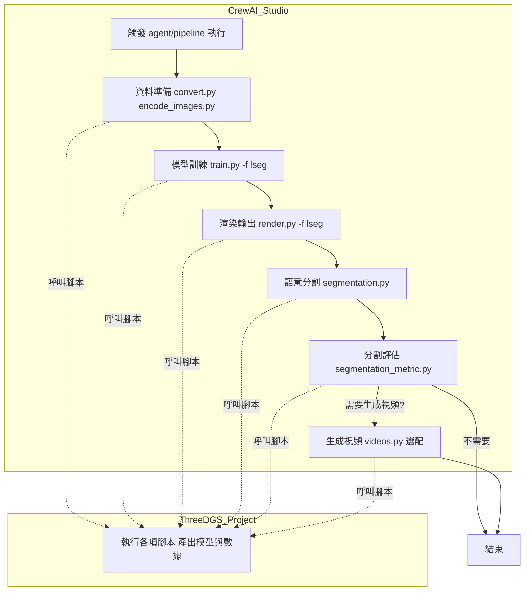

[[Augment Machine Learning Agent (CrewAI)]]

好！我們可以**逐步細化 LSEG 語意分割 agent pipeline 每一步所需的「資料/參數/檔案/工具/依賴」**，讓你設計 agent 時每個步驟都清楚知道：

- 需要什麼輸入/依賴（如資料集、特徵檔、權重、設定）
    
- 產生什麼輸出（如模型、mask、報告）
    
- 由誰負責（CrewAI agent 還是 3DGS 腳本）
    
- 主要可調參數
    

這會讓你的自動化流程**100%落地、可維護、可複用**！

---

# 🟦 LSEG Pipeline 工作流程細化

---

## 1️⃣ 資料準備（convert.py, encode_images.py）

|項目|說明|輸入|輸出|需用參數/依賴|
|---|---|---|---|---|
|convert.py|圖像尺寸、格式轉換|原始圖像資料夾|標準化圖像 `images/`|--resize, 原始圖像路徑|
|encode_images.py|LSeg特徵抽取（CLIP backbone）|`images/` (處理後)|特徵圖 `rgb_feature_langseg/`|--backbone, --weights, --outdir, --test-rgb-dir|
|**依賴**|需要 `demo_e200.ckpt`（CLIP/LSeg權重）|||pytorch, clip, encoding|

---

## 2️⃣ 模型訓練（train.py -f lseg ...）

|項目|說明|輸入|輸出|需用參數/依賴|
|---|---|---|---|---|
|train.py|訓練高斯點雲、語意特徵|`images/`, `rgb_feature_langseg/`|output/OUTPUT_NAME/ (模型、特徵、點雲、ckpt)|-f lseg, --iterations, --speedup, --resolution, --percent_dense 等|
|**依賴**|pytorch, pytorch-lightning, plyfile, etc.|||需指定訓練資料路徑和特徵目錄|

---

## 3️⃣ 渲染輸出（render.py -f lseg ...）

|項目|說明|輸入|輸出|需用參數/依賴|
|---|---|---|---|---|
|render.py|輸出各種渲染圖/特徵|訓練模型 output/|output/ 下 images/, feature_map/, novel_views/|--iteration, -f lseg, --novel_view, --multi_interpolate|
|**依賴**|需有訓練完成的模型、ckpt||||

---

## 4️⃣ 語意分割（segmentation.py）

|項目|說明|輸入|輸出|需用參數/依賴|
|---|---|---|---|---|
|segmentation.py|對渲染特徵圖語意分割|output/ 的特徵圖|mask/ 語意分割結果|--data, --iteration, --label_src（可指定語意）|
|**依賴**|需有 LSeg 特徵||||

---

## 5️⃣ 分割評估（segmentation_metric.py）

|項目|說明|輸入|輸出|需用參數/依賴|
|---|---|---|---|---|
|segmentation_metric.py|評估 mask 準確率|output/ 的 mask, gt 特徵|報告（分割準確率等指標）|--backbone, --weights, --student-feature-dir, --teacher-feature-dir, --test-rgb-dir, --eval-mode|
|**依賴**|須有 ground-truth/標準語意特徵||||

---

## 6️⃣ 生成視頻（videos.py, 選配）

|項目|說明|輸入|輸出|需用參數/依賴|
|---|---|---|---|---|
|videos.py|多張渲染圖組成視頻|output/ 下圖像|mp4 或 gif 視頻|--data, --fps, -f lseg, --iteration|
|**依賴**|imageio, opencv-python||||

---

# 🟨 【責任分工備註】

- **CrewAI Agent/Tools**  
    　- 負責：「流程調度、自動 CLI 參數組合、log 回傳、結果同步、批量管理」  
    　- 設計時只需保證每步「資料夾/檔案/參數」配置對上
    
- **3DGS 專案腳本**  
    　- 真正執行運算、模型訓練、圖像處理、mask 產生
    

---

# 🟧 【細化版流程對照總表】

|步驟|CrewAI Agent|3DGS 腳本|輸入|輸出|關鍵參數|
|---|---|---|---|---|---|
|1.準備|DataPrepAgent|convert.py, encode_images.py|原圖像, demo_e200.ckpt|images/, rgb_feature_langseg/|--backbone, --outdir|
|2.訓練|TrainingAgent|train.py|images/, 特徵圖|output/模型,特徵,ckpt|-f lseg, --iterations|
|3.渲染|RenderingAgent|render.py|output/模型,ckpt|渲染圖,特徵,novel_view|-f lseg, --iteration|
|4.分割|SegmentationAgent|segmentation.py|渲染特徵圖|mask/分割圖|--label_src|
|5.評估|EvaluationAgent|segmentation_metric.py|mask/,gt特徵|報告/評分|--eval-mode|
|6.視頻|(可選) VideoAgent|videos.py|output/圖像|mp4,gif視頻|--fps|

---

## ⭐ **這樣細化後，agent team/自動化/維護都會超級穩定！**

你可以根據這份表格：「

- 設計每個 agent tool 的參數接口
    
- 對應出 CrewAI 流程和 3DGS 實際腳本責任
    
- 萬一要跨平台/搬移也能明確列出每步依賴和輸入輸出

[[Augment Machine Learning Agent (CrewAI)]]